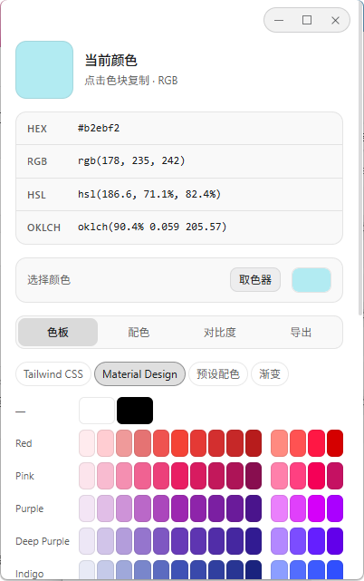
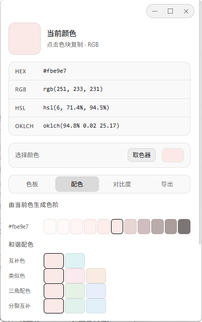
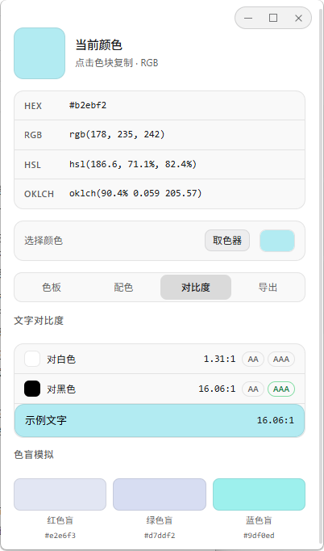
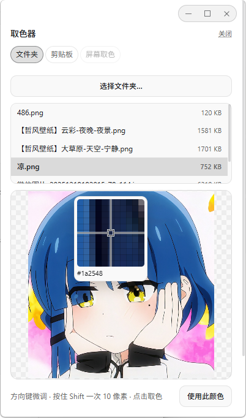

# 色卡选择器 · Color Picker

给 PI-Desktop 加一套取色与配色工具:翻色板、从图片里取色、配一套和谐色、确认它能不能看清、把结果导出成代码——顺手还能把满意的配色变成应用自己的主题。

| | |
| --- | --- |
| 版本 | 0.4.0(尚未上架) |
| 插件 id | `io.github.catdford.color-picker` |
| 宿主 | 主题依赖宿主较晚开放的能力,详见[已知限制](./docs/permissions.md#已知限制) |
| 许可 | MIT |

## 界面

面板从上到下是一条固定动线:当前色 → 四种记法 → 取色器 → 四个标签页。

<!-- 面板是竖屏比例(约 400×640)。四张按同一高度并排,换图直接覆盖同名文件即可。 -->
<table>
  <tr>
    <td align="center"></td>
    <td align="center"></td>
    <td align="center"></td>
    <td align="center"></td>
  </tr>
  <tr>
    <td align="center"><sub>色板</sub></td>
    <td align="center"><sub>配色</sub></td>
    <td align="center"><sub>对比度</sub></td>
    <td align="center"><sub>取色器</sub></td>
  </tr>
</table>

| 标签页 | 做什么 |
| --- | --- |
| **色板** | 四个来源(Tailwind / Material / 预设 / 渐变),点色块即设为当前色 |
| **配色** | 色阶、和谐配色,以及 AI 配色的入口 |
| **对比度** | WCAG 对比度、AA/AAA 判定、三种色盲模拟 |
| **导出** | 选范围和格式一键复制;底部是 PI-Desktop 主题 |

**取色器**在面板顶部,点开是一层盖住整个面板的取色界面,来源可选文件夹里的图片或剪贴板历史里的最新图片。

## 它能帮你做什么

- **查色号** —— Tailwind v4 26 个色系、Material 19 个、15 套预设、12 条渐变,点一下复制成 HEX / RGB / HSL / OKLCH;Tailwind 给的是官方原值。
- **取色** —— 设计稿、截图、素材图都行:放大镜看真实像素,方向键微调一像素,点击取出。
- **配色** —— 互补 / 类似 / 三角 / 分裂互补四种和谐规则、50–950 色阶,或一句风格描述让 AI 生成整套带名字的配色。
- **对比度** —— 对白、对黑的 WCAG 数值与 AA / AAA 判定,加三种色盲模拟。
- **导出** —— CSS 变量、Tailwind v4 `@theme`、Tailwind v3 配置、JSON,复制即用。
- **换主题** —— 把当前配色一键装成 PI-Desktop 主题,侧栏、编辑器、设置页一起换色。
- **Agent 直接用** —— 注册了 `suggest_palette` 工具和一份配色 skill,一句话就能让它配一套。

## 三个典型用法

**查一个色号。** 色板页切到 Tailwind,点中要用的颜色 → 上方四种记法直接读,点任意一行复制。

**从设计稿取色。** 把设计稿导出成 PNG 放进一个文件夹 →「取色器」→「选择文件夹…」→ 点开图片 → 放大镜对准、方向键微调 → 点击取出。取到的颜色立刻成为当前色,继续做配色或导出。

**配一套色并落地。** 在配色页用色阶或 AI 得到一套颜色 →「整套用作导出」→ 导出页选 CSS 变量或 Tailwind 格式 → 复制。如果这套颜色你也想用在应用本身上,导出页底部的「生成并应用」会把它做成一个 PI-Desktop 主题。

## 让 Agent 也能配色

插件向 Agent 注册了一个 `suggest_palette` 工具和一份配色 skill。你在对话里说"用 #3b82f6 当主色,配一套深色科技感的方案",Agent 会自己调用它——不需要你念工具名。AI 使用的是你在 PI-Desktop 里已经配好的模型,凭据不会经过插件。

## 打开面板

命令面板里的「Color Picker: Open」随时可以打开它。**系统级快捷键还没进这个版本**:`Alt+Shift+C` 需要宿主的 `keyboard.globalShortcut` 权限,而它至今没有出现在任何发布版里——宿主一发布就会补上,代码与决策记在 [PLAN.md](./PLAN.md)。

## 安装

尚未上架。当前可以按开发插件加载:启动 PI-Desktop 开发版,进入「插件 → Load development plugin」选择本目录。插件主进程的改动会热重载;**新增权限会中断热重载并要求重新授权**,漏授时面板会直接说明缺哪一项以及怎么补。

申报了哪些权限、数据怎么流动、有哪些已知限制,见 [docs/permissions.md](./docs/permissions.md)。

## 开发

```
main.js                    插件入口(主进程):命令、AI 与主题通道、Agent 工具
renderer/                  面板与工作面板视图共用的界面(沙箱页面,走 window.pluginBridge)
  index.html  app.js  styles.css
lib/color.js               HEX/RGB/HSL/OKLCH 转换、CSS 颜色字符串解析
lib/palette.js             色板数据访问(统一命名与色值格式)
lib/generate.js            色阶生成与和谐配色规则
lib/contrast.js            WCAG 对比度与色盲模拟
lib/export.js              CSS 变量 / Tailwind / JSON 导出
lib/pick.js                取色几何与取样(放大镜只认 { width, height, pixelAt },与像素来源解耦)
lib/ai.js                  配色提示词、模型输出的容错解析
lib/theme.js               宿主主题:配色 → 设计令牌映射(明暗两套)、CSS 生成与自校验
skills/palette-suggestions.md  Agent 用的 skill 文档
lib/data/*.js              色板数据(tailwind / material 为生成产物,勿手改)
tools/gen-palettes.mjs     从 npm 固定版本包重新生成色板数据
tests/                     node --test 用例(108 条)
```

`lib/*.js` 是 UMD 模块:面板以经典脚本加载(沙箱页面是 `file://` 源,不加载 ES module),Node 里 `require` 直接用——所以主题预览和实际应用走的是同一份生成逻辑,面板里看到的就是将应用的那份。

```bash
node --test                                                     # 全部用例
node tools/gen-palettes.mjs                                     # 重新生成色板数据(需要网络,日常不必跑)
node <PI-Desktop>/packages/plugin-devkit/dist/cli.js check .     # 打包前校验
```

> `check` 会报三条 `permission.unused` 误报(`clipboard.write`、`clipboard.read`、`fs.read`):静态检查只读 `main.js`,而这三项的调用发生在面板里,那是宿主给面板设计的正常通道。另外它会如实提示 `agent.tool.register`、`agent.prompt.inject` 属于高风险权限。

完整规划、已完成的阶段与二期(屏幕取色)的宿主需求见 [PLAN.md](./PLAN.md);真机验收清单见 [TESTING.md](./TESTING.md)。

## English

A color picker and palette tool for PI-Desktop. Browse the full Tailwind v4 and Material palettes plus presets and gradients, copy any color as HEX / RGB / HSL / OKLCH, pick colors out of an image or a pasted screenshot with a pixel loupe, generate harmony schemes, 50–950 scales or an AI palette from a style description, check WCAG contrast and color-blindness simulation, and export CSS variables, a Tailwind theme or JSON. The current color can also become a PI-Desktop theme in one click. A `suggest_palette` tool plus skill let the agent ask for a palette directly. A global shortcut is not part of this build yet — it needs a host permission that has not shipped in a release. Not published to the marketplace yet; see [PLAN.md](./PLAN.md).

## License

MIT
